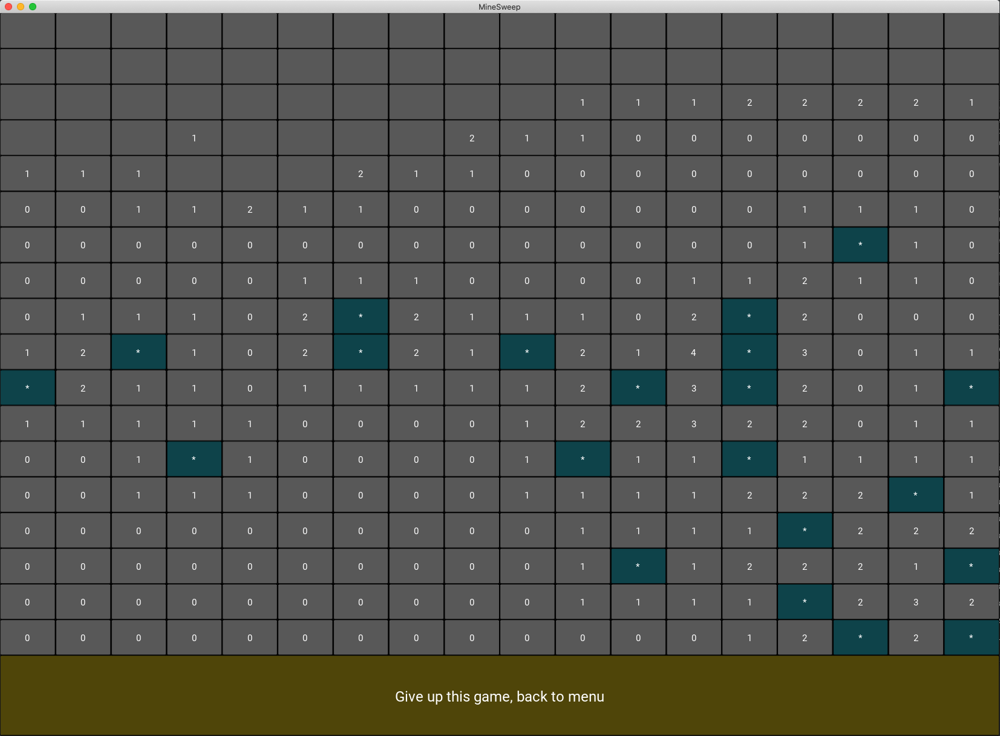
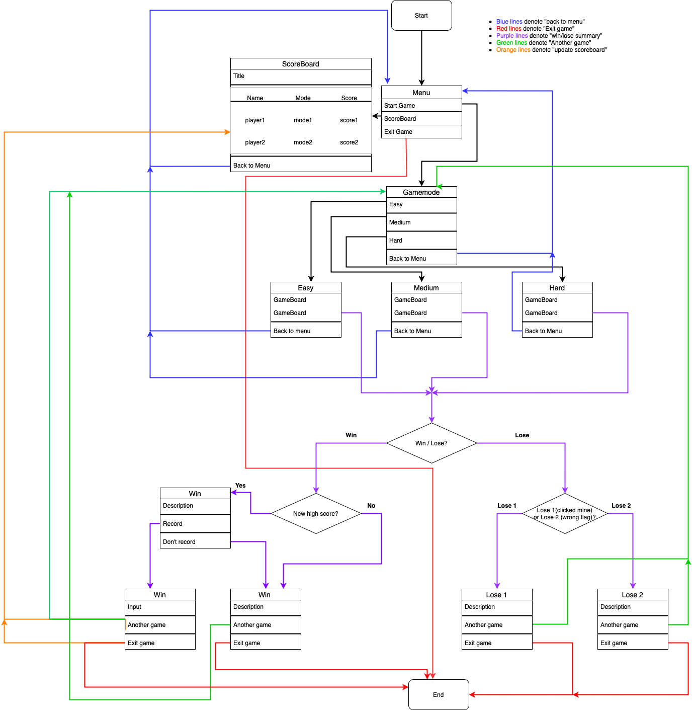

# Mine-Sweeping-Game

### 10.009 Digital World Final Assignment

### Author: Qiao Yingjie, 1004514

*In case you can't view the photos in the readme.md properly,
you can read it on my GitHub repository:
https://github.com/YingjieQiao/Mine-Sweeping-Game*

*Please refer to the **"mineSweeper"** branch for the final version (if you are viewing on Github)*

## Introduction

This is a classical MineSweeper game written in Python with Kivy GUI framework, 
designed to be a fully functional game app with comprehensive game modes, scoring system, 
hassle-free page-switching, and many more.

Your goal is to explore the field with mines underlying (by using left click)
and flag out all the grids that contain mines (by using right click).

Here is a video demo of my game: TOCOME

**In case you can't view the screenshot of the game, you can find it in "./assets/gameboard.png"**

You can also find out more about this game from [this wikipedia page](https://bit.ly/3cOhUQ0).

## Dependicies

- Kivy

## How to play

In my MineSweeper game, you can get to choose 3 difficulty levels:

* easy: 10x10 grid field with 10 mines
* medium: 18x18 grid field with 32 mines
* hard: 24x24 grid field with 99 mines

To win this game, you need to flag out all the grids that contain mines by using right-click.

To find out whether a grid contains a mine, you need to use left-click to click on a safe grid you are  sure about, and the safe grid will display a number that equals to the number of mines in the 8 grids 
surrounding it. More specifically, the number of mines in the 3x3 grid area 
with the grid you just clicked as the center.

You may think: "This game is easy! I can just flag all the grids and win". It doesn't work that way. 
You have limited number of flags, which is equal to the number of mines. If you mistakenly flagged a safe grid,
and do not unflag it before you use up all your flags -- in other words, there are mines you never flag until the end of the game -- you lose. 
So think twice and flag cautiously!

Of course, if you click on a mine, you also lose.

### Description of Code

* ### Schematics

A video demontration of the structure of the code: https://www.youtube.com/watch?v=nXOdyBBEVR8.

The workflow of my code is shown by the schematics diagram below:

**In case you can't view the schematics, you can find it in "./assets/schematics.png"**

* ### Documentation

***module* Global**

`Global` a module that I created myself by creating a python script file `Global.py` in the same directory as the game file.
This file contains all the global variables I used during the implementation of the game. 
You can find me importing this file as a module at **line 15**: `import Global`.

***class* MineSweep()**

The main game app class inherited the `App` class from kivy. The `build()` method returns
the `ScreenManager`, where screens `Menu()`, `Gamemode()`, `Easy()`, `Medium()`, `Hard()`
are instantiated and stored.

***class* Grid()**

The core object that implements the minesweeper gaming mechanism. 

- **Attributes**

    - isMine
    
        `isMine` is an integer attribute. `isMine` = 1 if this `Grid()` represents a mine. `isMine` = 0 if this `Grid()` is safe.
    
    - isClicked
    
        `isClicked` is an integer attribute. `isClicked` = 1 if this `Grid()` is clicked or is looped through by the `reveal_zeros()` method;
        and `isClicked` = 0 if otherwise.
    
    - isFlagged
    
        `isFlagged` is an integer attribute. `isFlagged` = 1 is a this `Grid()` is flagged as mine; and `isFlagged` = 0 if otherwise.
    
    - neighbors
    
        `neighbors` is an integer attribute and equals to the number of mines in the 8 other `Grid()` objects 
        surrounding the central `Grid()` object that the `neighbors` property is describing.
    
    - location
    
        `location` is a list property that contains the (x,y) coordinate of a `Grid()`.
    
    - button
    
        `button` attribute is a kivy widget, `Button`, 
        which actualize and display the `Grid()` object on the screen.
        To make it clear, the attribute is created by `self.button = Button(...)`
    
    - difficulty
        
        `difficulty` is the `Easy()`, `Medium()`, or `Hard()` object passed to each `Grid()` object, created by
        `self.difficulty = difficulty` where `difficulty` represents the `Easy()`, `Medium()`, or `Hard()` object.
        This is to call the methods defined in those difficulty objects. 
    
- **Methods**

    - build()
    
        Give value to `location` attribute. Give value to `neighbors` attribute by calling `count_ntighbors()`.
    
    - count_neightbors()
    
        Give value to `neighbors` attribute.
    
    - on_pressed()
    
        Callback function for `Grid().button` which is a `Button` object as explained above in the "Attributes" section.
        Implement the `reveal_zeros()` function and flagging grid, as well as win/lose detection.
    
    - reveal_zeros()
    
        Once a `Grid()` that has 0 mines in the 8 `Grid()`'s surrounding it, automatically click the 8 safe `Grid()`'s
        as well. Recursively do this until the `Grid()` object passed into this function has 1 or more mines
        in its surrounding 8 `Grid()`'s.   

***class* Menu()**

The menu screen class, inherited `Screen` class from kivy.

- **Widgets**

    - title
     
        `Label` widget displaying a text string as the title
    
    - start_button
    
        A `Button` object used to switch to gamemode screen.
    
    - scoreboard_button
    
        A `Button` object used to switch to scoreboard `Popup` window.
    
    - exit_button
    
        A `Button` object used to exit the game app.
    
    - layout
    
        The root layout of the `Menu()` screen.
    
- **Methods**

    - change_to_gamemode()
    
        Callback function binded to `start_button`, used to switch to gamemode screen.

    - change_to_scoreboard()
    
        Callback function binded to `scoreboard_button`, used to switch to scoreboard `Popup` window.
    
    - exit_game()
    
        Callback function binded to `exit_button`, used to exit the game app.
    
    
***class* Scoreboard()**

The popup window that inherited the `Popup` class of kivy. Read the names + difficulty + score
achieved from file `score_local.txt`.

- **attributes**

    - title
    
        Title text for the `Popup` window.

- **Widgets**

    - scoreboard_label
     
        `Label` widget displaying a text string as the title
    
    - menu_button
    
        A `Button` object used to switch back to menu screen.
    
    - data_grid
    
        A `GridLayout` with 3 columns as the scoreboard, where 3 `BoxLayouts` are added to the `GridLayout` to present a low cognitive-load UI.
    
    - top_bar, bottom_bar
    
        Two `BoxLayout` used to hold the `scoreboard_label` and `menu_button` respectively.
    
    - layout
    
        The root layout of the `Scoreboard()` popup window.
    
    
- **Methods**

    - change_to_menu()
    
        Callback function binded to the `menu_button`, used to dismiss the `Popup` window and switch back to menu screen.
    

***class* Gamemode()**

Gamemode screen class inherited `Screen` class from kivy, where you can choose the level of 
difficulty and start game.

- **Widgets**

    - gamemode_label
     
        `Label` widget displaying a text string as the title
    
    - easy_button
    
        A `Button` object used to start playing the game at level "easy"
    
    - medium_button
    
        A `Button` object used to start playing the game at level "medium"
    
    - hard_button
    
        A `Button` object used to start playing the game at level "hard"
    
    - menu_button
    
        A `Button` object used to switch back to menu screen.
    
    - layout
    
        The root layout of the `Gamemode()` screen.
    
- **Methods**

    - change_to_easy()
    
        Callback function binded to the `easy_button`, used to start playing the game at level "easy".
    
     - change_to_medium()
    
        Callback function binded to the `medium_button`, used to start playing the game at level "medium".
    
     - change_to_hard()
    
        Callback function binded to the `hard_button`, used to start playing the game at level "hard".

    - change_to_menu()
    
        Callback function binded to the `menu_button`, used to switch back to menu screen.
    
    
***class* Easy()**, ***class* Medium()**, ***class* Hard()**

The structure of these 3 classes are essentially the same since they are all the game board screen that inherited 
the `Screen` class from kivy. The differences are the size and number of mines, represented by
different `height`, `width`, `mines` attributes.

- **Attributes**

    - width
    
        The width of the game board.
    
    - height
    
        The height of the game board.
    
    - mines
    
        The number of mines to be scattered into the grid field.
    
    - win_popup
    
        The `Popup` window when triggering the winning condition: properly flagged all the mines.
    
    - lose1_popup
    
        The `Popup` window when triggering the first losing condition: clicking on a mine.
    
    - lose2_popup
    
        The `Popup` window when triggering the second losing condition: flagged a safe grid and never unflag before using up all flags.

    - field
    
        A 2D list created by `init_grid()` method, containing a total number of `height`*`width` grid objects.

- **Widgets**

    - root_layout
    
        The root layout of `Easy()` screen.
    
    - layout
    
        `GridLayout` of size `width`*`height`, containing all the `Grid()` objects.
    
    - bottom_bar
    
        `BoxLayout` containing the `change_to_menu_button`.
    
    - change_to_menu_button
    
        A `Button` object used to give up the current game, reset the game board, and switch back to menu screen.

- **Methods**

    - init()
    
        Called in `__init__`. Setting to an independent function rather than in `__init__` because it will be used
    when reinitializing the game board.
    
    - reinitalize()
    
        Reset the game board for another game.
    
    - init_grid()
    
     Create a 2D list with `Grid()` objects for the game board.
    
    - change_to_menu()
    
        Used to switch back to menu **from the game**. `reinitalize()` is called.
    
    - change_to_menu_win()
    
        Used to switch back to menu **from the win popup window**. `reinitalize()` is not called.
    
    - change_to_win()
    
        Used to switch to `Win()` popup window.
    
    - change_to_lose1()
    
        Switch to `Lose1()` popup window when triggering the first losing condition: clicking on a mine.
    
    - change_to_lose2()
    
        Switch to `Lose1()` popup window when triggering the second losing condition: flagged a safe grid and never unflag before using up all flags.

***class* Win()**

The popup window that inherited the `Popup` class of kivy.

- **Attributes**

    - title
    
        Title text for the `Popup` window.
    
    - scoreAchieved
    
        Score achieved in the game.
    
    - diffi
    
        The `Easy()`, `Medium()` or `Hard()` object passed in to `Win()` Used to call methods defined in the previous class.
    
- **Widgets**

    - layout
        
        The root layout
    
    - win_label, hi_label, hi_noNewScore
    
        `Label` object used to display text on the screen
    
    - score_button
    
        `Button` object used to continue to next stage (as a middle step)
    
    - exit_button
        
        `Button` object used to exit the game app.
    
    - score_label
    
        `Label` object used to display score.
    
    - yes_button
    
        `Button` object used to continue to score recording.
    
    - no_button
    
        `Button` object used to skip score recording.
    
    - menu_button
    
        `Button` object used to switch back to menu.
    
    - anotherGame_button, yes_anotherGame_button, no_anotherGame_button
    
        `Button` object used to start another game.
    
- **Methods**

    - init()
    
        Called in `__init__`. Setting to an independent function rather than in `__init__` because it will be used
    when reinitializing the popup window.
    
    - score()
    
        Callback function of `score_button`. Calculate the `scoreAchieved`. Read the `score_local.txt` file and compare to check if `scoreAchieved` 
    is a new high score under this difficulty.
    
    - yes()
    
        Callback function of `yes_butto`. Take player's name input.
    
    - no()
    
        Callback function of `no_button`. Skip recording new high score.
    
    - anotherGame()
    
        Callback function of `anotherGame_button`. Used to start another game.
    
    - yes_anotherGame()
    
        Callback function of `yes_anotherGame_button`. Used to start another game.
    
    - no_anotherGame()
    
        Callback function of `no_anotherGame_button`. Used to start another game. 
        
    - record_highscore()
        Append the name + difficulty + score to the `score_local.txt` file.
        
    - record_exit_game()
        Append the name + difficulty + score to the `score_local.txt` file and exit the game app.
        
    - exit_game()
        Callback function of `exit_button`. Exit the game app.

***class* Lose1()**, ***class* Lose2()**

Popup window that inherited the `Popup` class of kivy. The structure of these 2 classes are essentially the same except the text displayed on the screen.

- **Attributes**

    - title
    
        Title text for the `Popup` window.
    
    - diffi
    
        The `Easy()`, `Medium()` or `Hard()` object passed into this popup window, depending on the gamemode currently engaged in.
    
    
- **Widgets**

    - layout
    
        The root layout of the `Popup` window.
    
    - lose_label1, lose_label2
    
        Displayed `Label` text on the screen.
    
    - anotherGame_button
    
        Used to dismiss the game and start another game.
    
    - exit_button
    
        Used to exit the game app.
     
- **Methods**

    - init()
    
        Called in `__init__`. Setting to an independent function rather than in `__init__` because it will be used
    when reinitializing the popup window.

    - anotherGame()
    
        Callback function binded to the `anotherGame_button`, which is used to dismiss the current `Popup` window and switch to `Gamemode()` screen.
    
    - exit_game()
    
        Callback function binded to the `exit_button`, which is used to exit the game app.
    

### References

1. Python documentation: https://docs.python.org/3/
2. Kivy documentation: https://kivy.org/doc/stable/